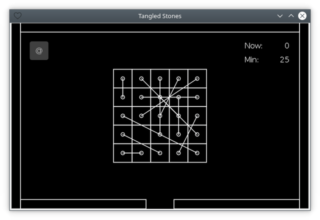

# Tangled Stones

[](https://github.com/thewizardplusplus/tangled-stones/actions/workflows/doc.yaml)
[](https://thewizardplusplus.github.io/tangled-stones/)
[](https://github.com/thewizardplusplus/tangled-stones/actions/workflows/lint.yaml)



2D puzzle game for Android inspired by various games about tangled webs.

_**Disclaimer:** this game was written directly on an Android smartphone with the [QLua](https://play.google.com/store/apps/details?id=com.quseit.qlua5pro2) IDE and the [LÖVE for Android](https://play.google.com/store/apps/details?id=org.love2d.android) app._

## Features

- physics entities:
  - static:
    - game field frame;
  - dynamic:
    - stones;
    - joins:
      - joins between stone pairs:
        - rope joint (it restricts a maximal distance only);
      - join for drag control:
        - mouse joint (it moves a stone to a cursor);
        - support of touches;
- game stats:
  - metrics:
    - current move count;
    - minimal move count;
  - autodetecting an initial minimum of a move count based on a count of stones;
  - storing in the [FlatDB](https://github.com/uleelx/FlatDB) database;
- initialization:
  - creating a game field frame:
    - based on a window size;
    - splitting a bottom border for destroying stones;
  - creating a stone grid:
    - based on a window size;
    - storing a count of stones in a game configuration:
      - loading from a JSON file;
      - validation via the JSON Schema;
  - creating joins between stone pairs:
    - automatically when creating stones;
    - random shuffling of joins;
- drawing:
  - drawing physics entities:
    - drawing join edges;
  - drawing a reset button:
    - based on a window size;
  - drawing game stats:
    - based on a window size;
- operations:
  - moving stones via drag control:
    - selecting a stone closest to a cursor;
    - freezing all stones except dragged ones;
    - destroying stones below a bottom limit;
  - restarting a game session:
    - cases:
      - on destroying all stones;
      - on resizing a window;
      - by a reset button;
    - automatical actions:
      - resetting game stats;
      - saving game stats:
        - if there are changes only;
  - resizing a window:
    - recreating:
      - game field frame;
      - stone grid;
      - joins between stone pairs.

## Building

Clone this repository:

```
$ git clone https://github.com/thewizardplusplus/tangled-stones.git
$ cd tangled-stones
```

Build the game with the [makelove](https://github.com/pfirsich/makelove) tool:

```
$ makelove ( win64 | macos | appimage )
```

Take the required build from the corresponding subdirectory of the created `builds` directory.

## Running

See for details: <https://love2d.org/wiki/Getting_Started#Running_Games>

### On the Android

Clone this repository:

```
$ git clone https://github.com/thewizardplusplus/tangled-stones.git
$ cd tangled-stones
```

Make a ZIP archive containing it:

```
$ git archive --format zip --output tangled_stones.zip HEAD
```

Change its extension from `.zip` to `.love`:

```
$ mv tangled_stones.zip tangled_stones.love
```

Transfer the resulting file to the Android device.

Open it with the [LÖVE for Android](https://play.google.com/store/apps/details?id=org.love2d.android) app.

### On the PC

Clone this repository:

```
$ git clone https://github.com/thewizardplusplus/tangled-stones.git
$ cd tangled-stones
```

Then run the game with the [LÖVE](https://love2d.org/) engine:

```
$ love .
```

## Documentation

- Table of Contents ([EN](docs/README.md) / [RU](docs/README_ru.md)):
  - Summary ([EN](docs/summary.md) / [RU](docs/summary_ru.md))
  - Gameplay ([EN](docs/gameplay.md) / [RU](docs/gameplay_ru.md))
  - Controls ([EN](docs/controls.md) / [RU](docs/controls_ru.md))

## License

The MIT License (MIT)

Copyright &copy; 2020-2021 thewizardplusplus
