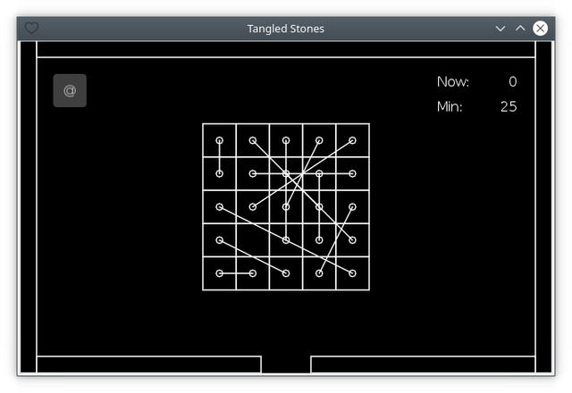

# Краткое описание ([EN](summary.md) / RU)

[<< Назад](README_ru.md)

На игровом поле расположен набор попарно связанных камней. Задачей игрока является распутать их и поместить в отверстие в нижней части экрана.

По умолчанию игра начинается с сетки, состоящей из одного камня. После каждого пройденного уровня сторона сетки увеличивается на единицу. (Однако автоматическое увеличение можно отключить в настройках игры.)
